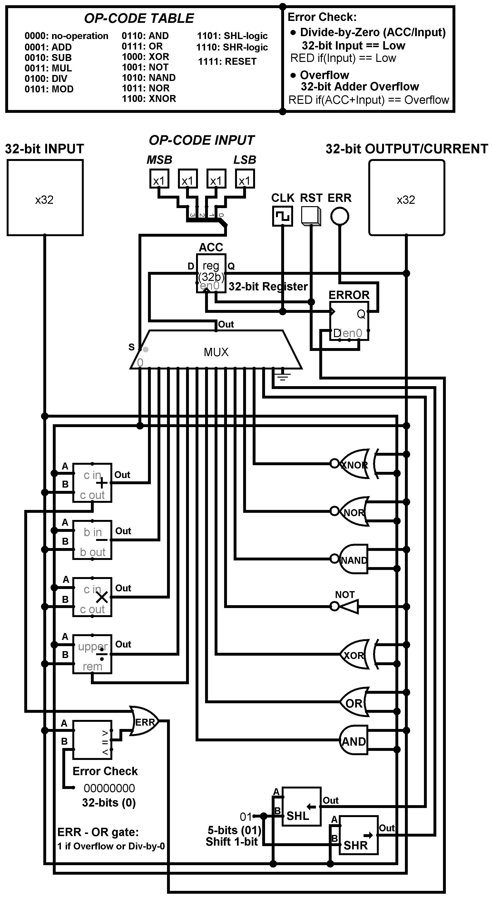

# 32bit-ALU (Arithmetic logic unit)
32 bits ALU include 16 commands to run/Verilog Code (.v) + Digital Circuit (.circ) 

---

---

# 1.	List of Parts:

- Inputs  
  - Clock	1 bit, the clock, feeds into the clock on the register Accumulator  
  - Input	32-bits, binary integer for input  
  - Opcode	4-bits, binary code to indicate the operation

- Outputs  
  - Error	1 bit, true if an error state has occurred  
  - Value	32-bits, the current output of the register Accumulator

- Interfaces  
  - ACC.D	32-bits, the next value into the register  
  - ACC.Q	32-bits, the current value from the register  
  - DFF.D	1-bit, the current value of ALU.Err_out  
  - DFF.Q	1-bit, the output value of Error  
  - Multiplexer.S	16-bits, the one-hot control into the multiplexer  
  - Multiplexer.Out	32-bits, output of the multiplexer into ACC  
  - Multiplexer.Ch0	32-bits, feedback for the current value of ACC into multiplexer  
  - Multiplexer.Ch1	32-bits, results of addition into the multiplexer  
  - Multiplexer.Ch2	32-bits, results of subtraction into the multiplexer  
  - Multiplexer.Ch3	32-bits, results of multiplication into the multiplexer  
  - Multiplexer.Ch4	32-bits, results of division into the multiplexer  
  - Multiplexer.Ch5	32-bits, results of division remainder into the multiplexer  
  - Multiplexer.Ch6	32-bits, results of AND into the multiplexer  
  - Multiplexer.Ch7	32-bits, results of OR into the multiplexer  
  - Multiplexer.Ch8	32-bits, results of XOR into the multiplexer  
  - Multiplexer.Ch9	32-bits, results of NOT into the multiplexer  
  - Multiplexer.Ch10	32-bits, results of NAND into the multiplexer  
  - Multiplexer.Ch11	32-bits, results of NOR into the multiplexer  
  - Multiplexer.Ch12	32-bits, results of XNOR into the multiplexer  
  - Multiplexer.Ch13	32-bits, results of 1-bit logical shift left into the multiplexer  
  - Multiplexer.Ch14	32-bits, results of 1-bit logical shift right into the multiplexer  
  - Multiplexer.Ch15	32-bits, connect to ground to reset the ACC (GND)  
  - Adder.A	32-bits, takes in the current value of the 32-bits ACC  
  - Adder.B	32-bits, takes in the value of the 32-bits input  
  - Adder.Cout	1-bit, the last carry, used for the Error Check (Overflow)  
  - Adder.Out	32-bits, the actual sum, feeds into Ch1  
  - Subtractor.A	32-bits, takes in the current value of the 32-bits ACC  
  - Subtractor.B	32-bits, takes in the value of the 32-bits input  
  - Subtractor.Out	32-bits, the actual sub, feeds into Ch2  
  - Multiplier.A	32-bits, takes in the current value of the 32-bits ACC  
  - Multiplier.B	32-bits, takes in the value of the 32-bits input  
  - Multiplier.Out	32-bits, the actual mul, feeds into Ch3  
  - Divider.A	32-bits, takes in the current value of the 32-bits ACC  
  - Divider.B	32-bits, takes in the value of the 32-bits input  
  - Divider.Remainder	32-bits, the actual remainder from divider (dividend - output * divisor)  
  - Divider.Out	32-bits, the actual div, feeds into Ch4  
  - Shifter.SHL.A	32-bits, Logic Shift Left, takes in the value of 32-bits Input 
  - Shifter.SHL.B	5-bits, Distance, how far to shift the 32-bits Input, 1-bit Logic Shift Left  
  - Shifter.SHL.Out	32-bits, result of shifting left the 32-bits Input by 1-bit  
  - Shifter.SHR.A	32-bits, Logic Shift Right, takes in the value of 32-bits Input  
  - Shifter.SHR.B	5-bits, Distance, how far to shift the 32-bits Input, 1-bit Logic Shift Right  
  - Shifter.SHR.Out	32-bits, result of shifting right the 32-bits Input by 1-bit  
  - Comparator.A	32-bits, first input to comparison, takes in the value of 32-bits Input  
  - Comparator.B	32-bits, Error Check, takes in the value of 32-bit constant 0  
  - Comparator.Out	1-bit, Equal Output, True if the 32-bits Input == 0  
  - Splitter.Bit0	1-bit, bit 0 from combined end (MUX Selection-bit S0)  
  - Splitter.Bit1	1-bit, bit 1 from combined end (MUX Selection-bit S1)  
  - Splitter.Bit2	1-bit, bit 2 from combined end (MUX Selection-bit S2)  
  - Splitter.Bit3	1-bit, bit 3 from combined end (MUX Selection-bit S3)  
  - Splitter.Out	4-bits, combined end of splitter (S[3:0] MUX)  

- Gates  
  - AND	32-bits, one channel is the input, the other the current ACC Q value  
  - OR	32-bits, one channel is the input, the other the current ACC Q value  
  - XOR	32-bits, one channel is the input, the other the current ACC Q value  
  - NOT	32-bits, only channel is the current value of ACC  
  - NAND	32-bits, one channel is the input, the other the current ACC Q value  
  - NOR	32-bits, one channel is the input, the other the current ACC Q value  
  - XNOR	32-bits, one channel is the input, the other the current ACC Q value  
  - OR_ERR	1-bit, one channel is Adder.Cout (Overflow), the other Comparator.Out ( if(input == 0))  

- CL	(Combinational Logic Components)  
  - Multiplexer	16-channel, 32-bits multiplexor for result operation  
  - Adder	32-bits, Full adder  
  - Subtractor	32-bits, Subtractor  
  - Multiplier	32-bits, Multiplier  
  - Divider	32-bits, Divider  
  - Shifter	32-bits, 1-bit Logic shift-left and shift-right  
  - Comparator	32-bits, Compare the 32-bit Input with 32-bit constant 0  

- SL	(Sequential Logic Components)  
  - ACC	32-bits D Register that contains the current system value  
  - DFF	1-bit D Flip Flop that contains the ERROR value  

- Modules  
  - Error Check	Tests for an error in Addition (Overflow), or Division (Divide-by-Zero)  
  - Test Bench	Main module, runs clock and stimulus. (not shown)  
  - Breadboard	convenient module to allow easy assembly. (not shown)  
